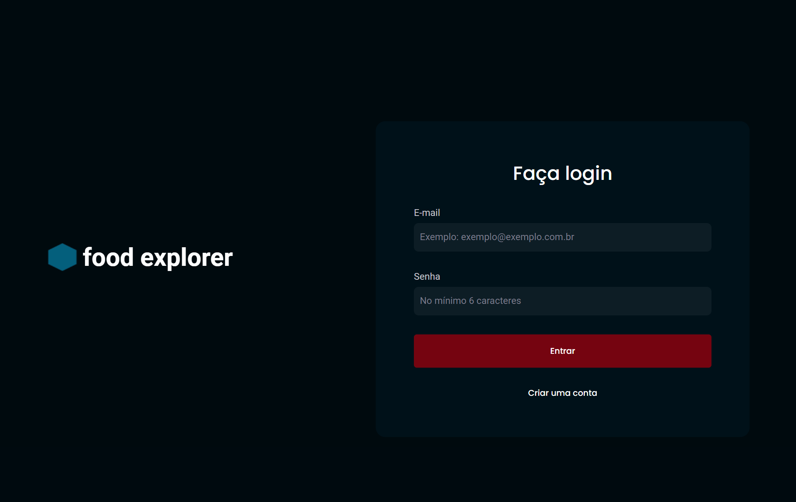
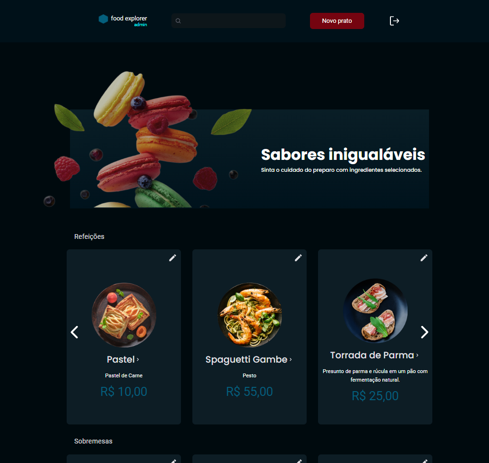

#   Food Explorer

Neste projeto foi desenvolvido o Food Explorer, que é um menu interativo para um restaurante.

O uso desse programa será separado por dois tipos de usuário, o cliente,  que poderá realizar pedidos e navegar entre as opções disponíveis no cardápio, e o admin, responsável por criar pratos e inclui-los no cardápio além de poder realizar a edição dos mesmos.

Todas as página deste projeto foram desenvolvidas pensando no método de mobile-first.

Para começar, temos a tela de login e de sign up, para a criação de conta. O padrão para criação de conta é criar um usuário do tipo cliente, para testar a funcionalidade precisa entrar com uma conta admin pré definida, nesse caso com o email admin@email.com e a senha admin.
   

Após efetuar o login nos deparamos com a página inicial do nosso projeto. Observem as diferenças no layout em relação ao tipo de usuário cadastrado.

 

 

# desafio_final_foodexplorer_frontend
